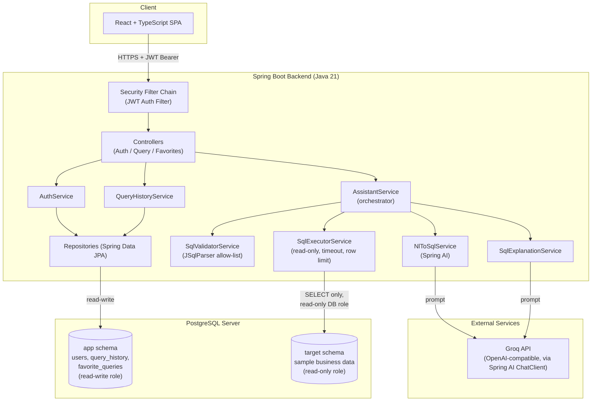
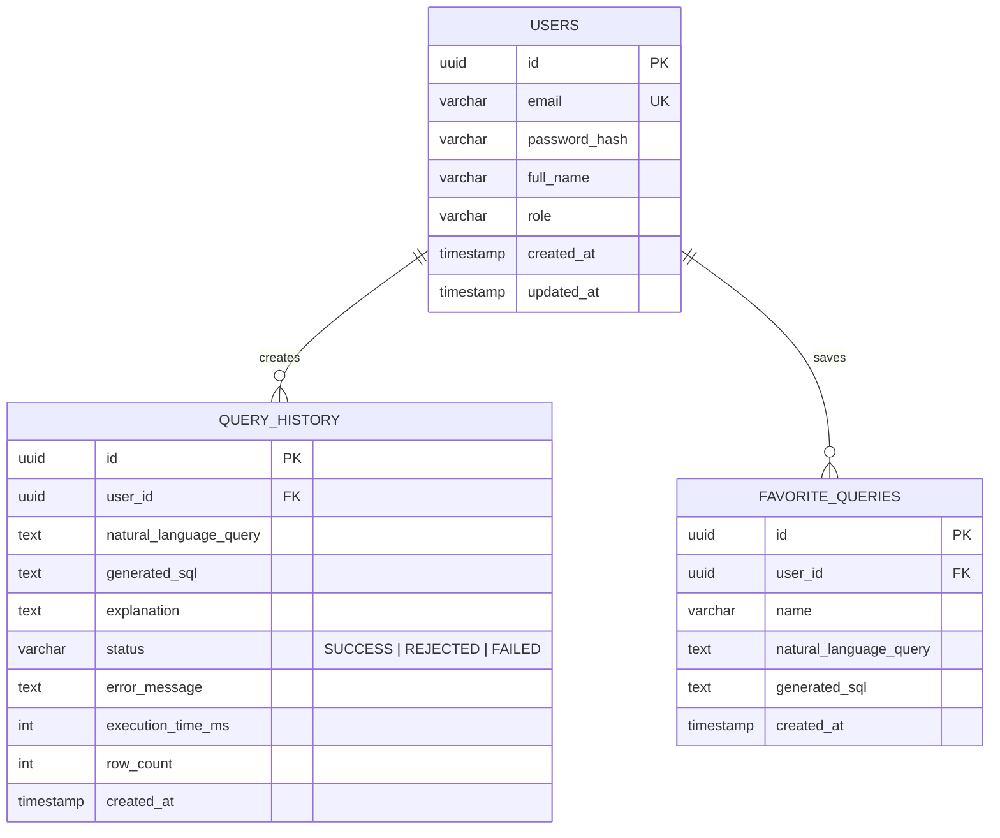
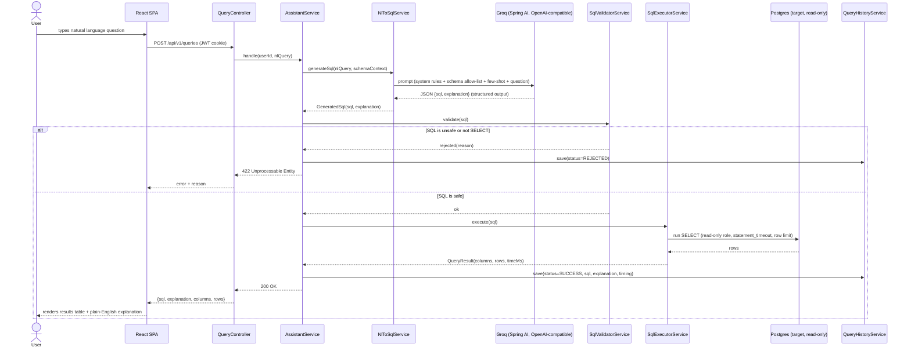
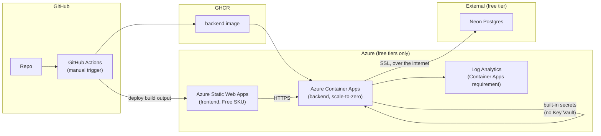

# SQLGenie — Architecture

## 1. Overall Architecture

The system is a single Spring Boot backend (pragmatic layered/clean architecture — Controller → Service → Repository, with DTOs at the boundary) fronted by a React + TypeScript SPA, backed by **one PostgreSQL server holding two logically separate schemas**:

- **`app` schema** — owned and fully read-write by the backend. Holds `users`, `query_history`, `favorite_queries`. This is the assistant's own operational data.
- **`target` schema** — the sample business dataset the user asks natural-language questions *about* (e.g. customers/orders/products). The backend connects to this schema through a **dedicated, database-enforced read-only role**, separate from the role used for the `app` schema.

This split is the single most important architectural decision in the system: it means that even if every application-level safeguard (prompt hardening, SQL validation) somehow failed, the database itself would refuse any write or any access to the `app` schema from the query-execution path. Defense in depth, not just defense in code.



## 2. Folder Structure

```
SqlGenie/
├── backend/
│   ├── pom.xml
│   └── src/main/java/com/anuraggupta/sqlgenie/
│       ├── SqlGenieApplication.java
│       ├── config/          # SecurityConfig, OpenAiConfig, DataSourceConfig, CorsConfig
│       ├── controller/      # AuthController, QueryController, FavoriteController
│       ├── dto/
│       │   ├── request/     # RegisterRequest, LoginRequest, NlQueryRequest, ...
│       │   └── response/    # AuthResponse, QueryResultResponse, ErrorResponse, ...
│       ├── entity/          # User, QueryHistory, FavoriteQuery
│       ├── repository/      # UserRepository, QueryHistoryRepository, FavoriteQueryRepository
│       ├── service/         # interfaces: AuthService, AssistantService, QueryHistoryService...
│       │   ├── impl/        # implementations
│       │   ├── ai/          # NlToSqlService, SqlExplanationService, PromptTemplates
│       │   └── sql/         # SqlValidatorService, SqlExecutorService
│       ├── security/        # JwtService, JwtAuthFilter, UserDetailsServiceImpl
│       ├── exception/       # ApiException + subtypes, GlobalExceptionHandler
│       └── util/
│   └── src/test/java/...    # mirrors main package structure
├── frontend/
│   └── src/
│       ├── api/              # typed fetch/axios clients per resource
│       ├── components/       # QueryInput, ResultsTable, HistoryList, FavoritesList
│       ├── pages/             # LoginPage, RegisterPage, DashboardPage
│       ├── context/           # AuthContext
│       ├── types/             # shared TS interfaces mirroring backend DTOs
│       └── hooks/
├── docker-compose.yml         # local Postgres (+ later: backend, frontend)
├── .github/workflows/         # CI/CD pipelines
└── ARCHITECTURE.md
```

## 3. Database Schema



The `target` schema is a separate, unrelated sample dataset (e.g. a small e-commerce set: `customers`, `products`, `orders`, `order_items`) seeded at container startup — it has no FK relationship to the `app` schema tables above; the two are joined only conceptually, through the app's logic, never through SQL.

## 4. REST APIs

| Method | Path | Auth | Purpose |
|---|---|---|---|
| POST | `/api/v1/auth/register` | none | Create account |
| POST | `/api/v1/auth/login` | none | Issue JWT |
| POST | `/api/v1/queries` | JWT | Submit NL question → SQL → validate → execute → explain → persist history |
| GET | `/api/v1/queries/history` | JWT | Paginated query history for current user |
| DELETE | `/api/v1/queries/history/{id}` | JWT | Delete a history entry |
| POST | `/api/v1/favorites` | JWT | Save a query as favorite |
| GET | `/api/v1/favorites` | JWT | List current user's favorites |
| DELETE | `/api/v1/favorites/{id}` | JWT | Remove a favorite |
| GET | `/actuator/health` | none | Liveness/readiness probe |

## 5. Authentication Flow

Stateless JWT auth via Spring Security.

1. `POST /auth/register` — password hashed with BCrypt (`PasswordEncoder`), user persisted.
2. `POST /auth/login` — credentials verified via `AuthenticationManager`; on success, `JwtService` issues a signed access token (HS256, secret from config/Key Vault, short expiry — start at 24h for v1, revisit with refresh tokens later — see §10).
3. Client stores the token in an **httpOnly, Secure, SameSite=Strict cookie** (not `localStorage` — avoids XSS token theft) and the browser sends it automatically.
4. Every request passes through a `JwtAuthFilter` (a `OncePerRequestFilter`) that validates signature + expiry, loads the user, and populates `SecurityContextHolder`.
5. Controllers read the authenticated user via `@AuthenticationPrincipal` to scope history/favorites queries — a user can only ever see their own rows (enforced at the repository query level, e.g. `findByUserId`, never by trusting a client-supplied user id).

## 6. AI Request Flow (Natural Language → SQL)



Key design choice: the SQL **and** its explanation are requested from the LLM provider in a **single structured-output call** (Spring AI `BeanOutputConverter` mapping to a `GeneratedSql(sql, explanation)` record), not two separate round trips — halves LLM latency and cost per query. The validator never trusts the LLM's own claim that its output is safe; it independently parses and checks every response.

## 7. Database Execution Flow

1. `SqlExecutorService` uses a **separate `DataSource`** bound to a Postgres role (`readonly_query_user`) that has `GRANT SELECT` on the `target` schema only, and no privileges whatsoever on `app`.
2. Before execution: `SqlValidatorService` parses the SQL with **JSqlParser** (an AST parser, not regex/string matching — regex is trivially bypassed via comments or encoding) and rejects anything that isn't a single `Select` statement, rejects multiple statements, and rejects any table reference outside the allow-listed `target` schema tables.
3. Execution runs inside `@Transactional(readOnly = true)`, with `Statement.setQueryTimeout(...)` and `Statement.setMaxRows(...)` set explicitly — not relied on as the only control, but as a second layer beneath the DB-level `statement_timeout`.
4. Results are mapped to a generic `QueryResult(List<String> columns, List<Map<String,Object>> rows)` — the backend has no compile-time knowledge of the target schema shape, by design, since it must handle arbitrary generated SQL.

## 8. Deployment Architecture



Deliberately built to run at **zero ongoing cost**, not just "cheap" — every resource choice here
was picked against Azure's genuine perpetual free tiers, not a 12-month trial. Full rationale in
[`infra/main.bicep`](../infra/main.bicep)'s header comment and step-by-step setup in
[`docs/DEPLOYMENT.md`](../docs/DEPLOYMENT.md). Three deliberate deviations from a typical
"textbook" Azure deployment, each documented rather than accidental:

- **No Key Vault** — Container Apps' own built-in secrets are used instead. Fine for one
  service; would reconsider if multiple services needed to share secrets centrally.
- **No Azure-managed Postgres** — Flexible Server has no perpetual free SKU (only ~12 months of
  trial credit on a new subscription). The database is external (Neon's free tier) instead; the
  backend simply connects to it over the internet with SSL, same as it would to any managed
  Postgres — a genuinely common pattern, not a compromise unique to this project.
- **No Application Insights** — skipped to minimize the resource surface; Container Apps' own
  log streaming (`az containerapp logs show`) covers debugging needs for a demo-scale deployment
  without an extra resource to reason about.

Same GHCR-based image registry pattern already used for the Cartify project, for consistency across your Azure deployments.

## 9. Security Considerations

- **Least privilege at the DB level** — the read-only role is the real backstop, not the application code.
- **AST-based SQL validation** (JSqlParser), not regex — closes comment/encoding bypass tricks.
- **Prompt injection assumption**: the natural-language input is untrusted and may try to manipulate the LLM into producing destructive or out-of-scope SQL. Mitigation is layered: (a) system prompt restricts the model to an explicit table/column allow-list, (b) the validator independently re-checks every output regardless of what the model claims, (c) the DB role physically cannot write or see `app` data even if both (a) and (b) were bypassed.
- **JWT via `Authorization: Bearer` header**, stored client-side (not httpOnly cookies — decided in Module 1: simpler to exercise from Swagger/Postman during development, no CSRF surface since there's no cookie for the browser to send automatically). Short access-token expiry (15 min) and rotating, revocable refresh tokens bound the blast radius of a leaked token either way.
- **Rate limiting** on `POST /queries` — bounds both abuse and LLM API cost (per-user token bucket). Not yet built — see Future Scalability.
- **Secrets** (LLM API key, JWT secret, DB credentials) only ever in Container Apps' built-in secrets / environment config — never committed, never logged.
- **CORS** restricted explicitly to the deployed frontend origin.
- **Bean Validation** on every request DTO — reject malformed input before it reaches a service.

## 10. Future Scalability

- Stateless JWT auth → horizontal scaling behind Container Apps autoscale with no session affinity needed.
- Cache identical NL→SQL translations (Redis) to cut latency/cost on repeated questions.
- Refresh-token + revocation list (Redis) once the app needs shorter-lived access tokens.
- Move query execution to an async job pattern (submit → poll/webhook) if target datasets or LLM latency grow beyond a synchronous request budget.
- Multi-datasource support: a `data_source` entity so users can point the assistant at different target databases (credentials encrypted, stored via Key Vault references).
- Swap/add LLM providers with minimal change, since Spring AI's `ChatClient` abstraction is already provider-agnostic — already exercised in practice: the app currently points the OpenAI client at Groq's OpenAI-compatible endpoint rather than a dedicated provider integration.
- Read replica for `app` schema once `query_history` grows large; partition/archive old history.
